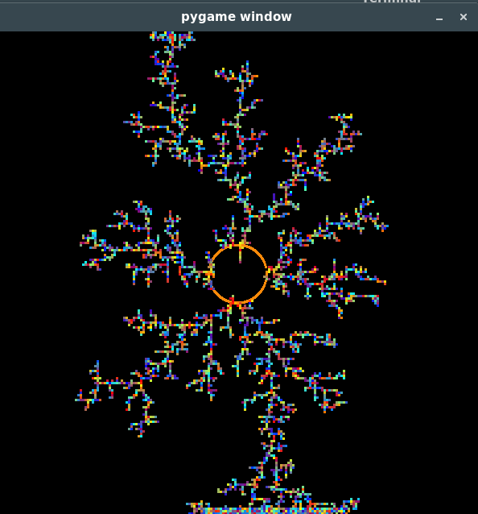

# Python_data/Multimedia

Python folder with tests and very simple applications related to graphics, images, games and multimedia in general!
Here's an overview of each file (I'll try to keep this updated..):

- *bfs.py*

    Uses pygame to simulate how a BFS works;
    

- *drunkenSailor.py*

    Uses a random path particle simulation to create neural/root -like structures. Takes longer to construct the bigger the resolution is set in the code; (req. pygame)
    

- *pygameSimple.py*

    An experiment in pygame using text, mouse events, sprite and a timer;
    

- *pygletAnim.py*

    Very simple ball physics test using the **pyglet** library. The green ball is in a simple harmonic oscillator movement, the red ball is in a movement with no acceleration, and the purple ball is in an accelerated movement.
    

- *turtleFractals.py*

    Uses the turtle module to create Koch fractals recursively with random colors in the form of a snowflake. The recursion level can be changed manually at the code (default: 3);
    

- *genTxt.py*

    Given a image (preferably simple), it prints out the list of (i, j) positions to "recreate" the image. You can see images generated with this type of approach at the "*imgDemo*" folder inside this directory. This application it's very useful in [this kind of program](https://github.com/robotenique/intermediateProgramming/tree/master/MAC0323/EP5);
    

- *gifGen.py*

    Transform a *.jpg* image into a gif with rotating colors. It constantly gets the color matrix of the image, then do a rotation of the matrix, and turn this into a file named 'top.gif' :D
    
